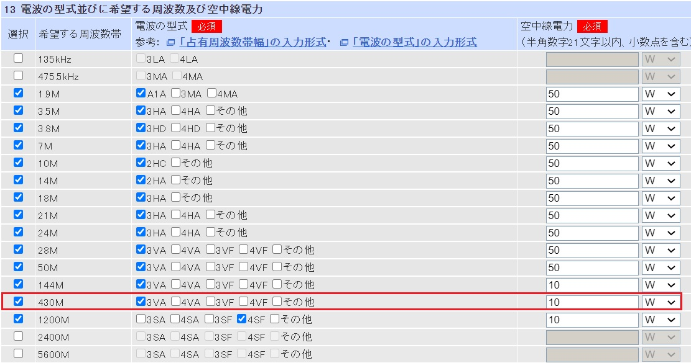
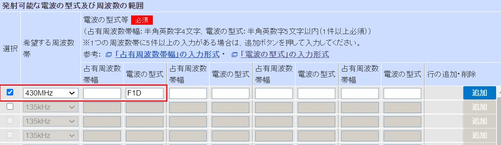
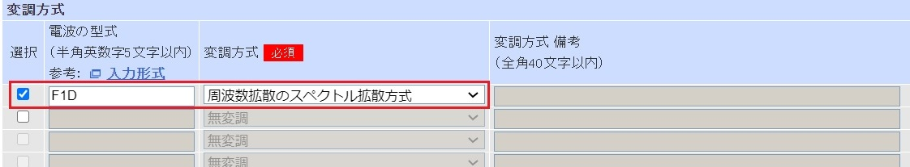
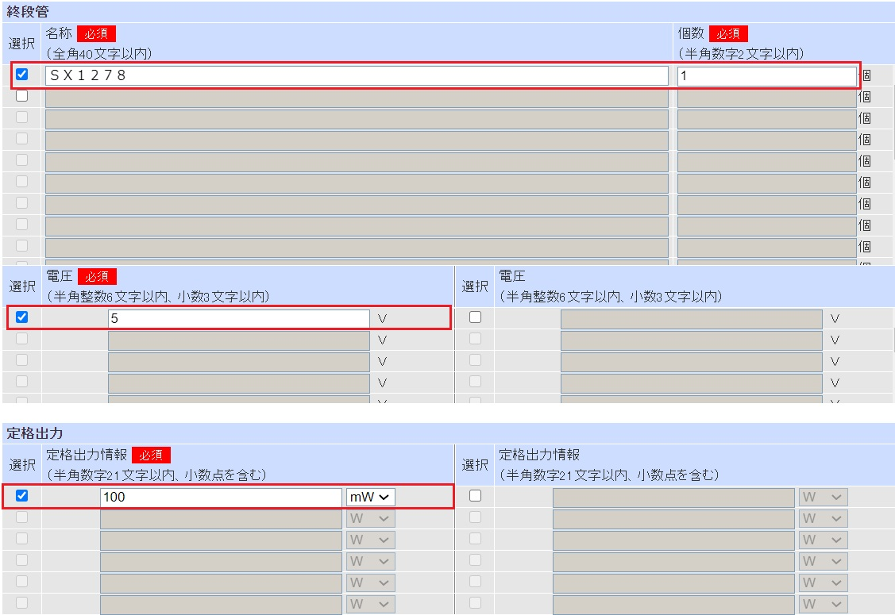

# LoRaトランシーバの変更申請の届出方法
電子申請・届出システムLiteによる申請方法を以下に示します。

## 電波形式
電波の形式はF1Dとなります。

今回の申請では既に430MHz帯は包括記号「3VA」で免許を受けていたために変更なしでした。
新規に免許される場合は包括記号「4VF」を入れてください。

## 工事設計書
工事設計書には次のように記載します。
### 発射可能な電波の形式及び周波数の範囲

### 変調方式

### 終段管・定格出力

### 添付書類
添付書類には以下を添付します。

今回の申請ではJARDでスプリアス計測を行った上で技術基準適合の保証を行いました。
1. [送信系統図]
[(LibreOffice Draw)](LoRa送信機系統図.odg)
[(PDF)](LoRa送信機系統図.pdf)
1. [通信方式詳細](通信方式詳細.md)
1. [スプリアス計測の結果](スプリアス計測の結果.jpg)
1. 技術基準適合の保証書(省略)
