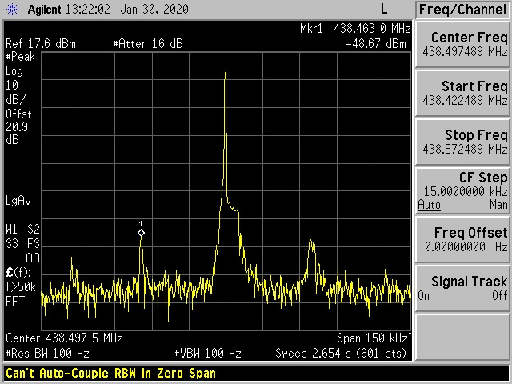
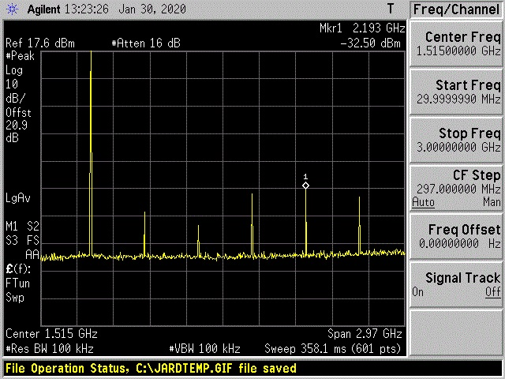

# LoRaトランシーバの変更申請の届出方法
電子申請・届出システムLiteによる申請方法を以下に示します。

## 電波形式
電波の形式はF1Dとなります。

今回の申請では既に430MHz帯は包括記号「3VA」で免許を受けていたために変更なしでした。
単独で新規に申請されるケースは少ないと思いますがF1Dが入った型式(4VF等)を指定して下さい。

## 工事設計書
工事設計書には次のように記載します。
### 発射可能な電波の形式及び周波数の範囲

### 変調方式

### 終段管・定格出力

### 添付書類
添付書類には以下を添付します。

今回の申請ではJARDでスプリアス計測を行った上で技術基準適合の保証を行いました。
1. [送信系統図]
[(LibreOffice Draw)](LoRa送信機系統図.odg)
[(PDF)](LoRa送信機系統図.pdf)
1. [通信方式詳細](通信方式詳細.md)
1. [スプリアス計測の結果](スプリアス計測の結果.jpg)
1. 技術基準適合の保証書(省略)

また参考までに帯域外領域・スプリアス領域の計測結果を以下に示します・

- 帯域外領域

- スプリアス領域

## 通信の相手方について
LoRaトランシーバの実験にあたり相手局の存在は大きな問題です。
今回の申請のあたり相手局は居るのかという議論がJARDの保証認定の際にも話題になりました。
関東総合通信局総合通信相談所に確認したところ以下の回答がありました。
### 質問内容
アマチュア局で個人的な興味に基づき伝搬実験を行いたいと思っております。
具体的にはインターネットによる遠隔操作により制御された無線局設備を用いて移動先から
局設備の制御を行い、移動先で直接操作する無線局との間で交信を行いたいと考えております。

1. 遠隔操作の対象となる局設備と移動先で直接操作する局設備が同一免許の移動す
る局に属し、同一局の異なる設備を用いて交信することは可能でしょうか？

1. また遠隔操作ではなく同一場所においても移動する局の複数の設備を用いて自局
同士が交信することは可能でしょうか？（一方がインターネットに接続されたゲート
ウェイのようなケースを想定しています）

1. 上記が法律上問題となる場合はその理由と解決方法についてご教示いただけないでしょうか。
例えば、既存の固定局の設備を遠隔操作可能とし、これを操作し直接操作する移動局の設備を用いて交信する
（固定局と移動局は同一の識別符号となります）とすれば問題ないでしょうか。
もしくは別途社団局などを設立し、異なる無線従事者による操作を行う必要までありますでしょうか。

### 回答
お問い合わせの自局間通信につきましては、同一コールサインの場合、「相手局の呼出符号」を送信できませんので、
無線局運用規則第２０条（呼出し）違反となります。

したがいまして、ご認識のとおり、社団局を開設することにより、同条の規定に違反しないようにする必要があるものと考えられます。

また、複数場所に分かれて複数の送信機で同時運用を行うことについては、電波法第２条第５号の規定により、無線局は無線設備と従事者が
一体となって機能するものとされていることから、運用することは認められません。
